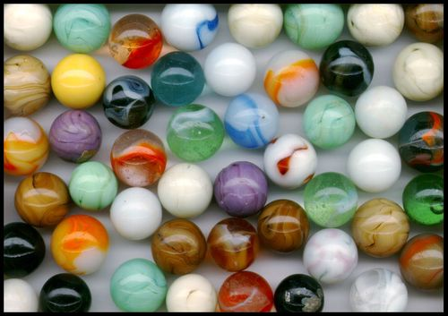
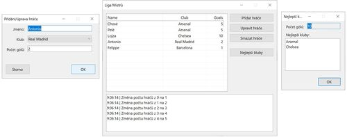

# Exercise 08 - PCX obrázky - čtení a dekódování bitmapy PCX obrázku

Cílem cvičení je vyzkoušet načíst a dékódovat bitmapu (rastrový obrázek) ve formátu PCX. Formát PCX vznikl v roce 1985 a představuje rastrový obrázek s bezestrátovou kompresí obrazových dat. Dnes se již nevyužívá a byl nahrazen novějšími formáty (JPEG, PNG, WEBP, ...). Pro jeho jednoduchost je ale vhodným kandidátem pro ozkoušení pochopení technické dokumentace a implementace dekodéru. Základní fakta:

* formát je dobře popsán na zdrojích:
  * https://en.wikipedia.org/wiki/PCX
  * http://netghost.narod.ru/gff/graphics/summary/pcx.htm
  * obě stránky jsou k dispozici pro offline prohlížení ve složce **Resources**
* existuje několik verzí formátu PCX a interně se může jednat o různé "typy" obrázků s ohledem na počet barev a barevných kanálů
  * pro jednoduchost se bude pracovat pouze se 2 variantami PCX obrázků:
    * 24bit true color obrázky (bit depth - 8, planes - 3)
    * 256 barevné paletové obrázky (bit depth - 8, planes - 1)
    * testovací obrázky jsou uloženy přímo v adresáři knihovny **PcxLibrary** a automaticky se kopírují k výstupu při kompilaci
    * soubory se suffixem **palette** jsou obrázky využívající 256 barevnou paletu - rozpoznání typu obrázku je ale nutné provádět na základě dat z hlavičky PCX souboru! soubory bez suffixu jsou true color obrázky
* struktura PCX souboru se skládá z 2 nebo 3 částí:
  * hlavička (128 bajtů)
  * obrazová data
  * rozšířená 256 barevná paleta (volitelná část)
* hlavička má pevnou strukturu a je detailně popsány v uvedených zdrojích
  * podle hlavičky lze určit formát obrázku a jeho rozměry
* obrazová data jsou uložena po jednotlivých řádcích (scan line)
  * každý řádek je kódován pomocí techniky RLL (run-length limited / run-length encoding)
    * algoritmus pro dekódování je uveden v přiložených zdrojích
  * po dekódování RLL jsou v řádku buď hodnoty RGB nebo indexy do palety barev
    * v případě true color obrázku jsou bajty v řádku uspořádany následujícím způsobem:
      * ```R(0,y) R(1,y) R(2,y) R(3,y) ... R(width-1,y) G(0,y) G(1,y) ... G(width-1,y) B(0,y) B(1,y) ... B(width-1,y)```
    * v případě paletového obrázku se jedná o index do rozšířené 256 barevné palety

## Postup

* ve tříde **PcxDecoder** (projekt **PcxLibrary**) je připraven základ pro dekódování obrázků
  * obrázek lze načíst a dekódovat synchronně:
    ```csharp
    var pcx = new PcxDecoder(stream);
    pcx.ReadHeader();
    pcx.DecodeImageInForegroundThread();

    var image = pcx.Image;
    ```
  * nebo jej lze dekódovat asynchronně:
    ```csharp
    var pcx = new PcxDecoder(stream);
    pcx.DecodingProgress += DecodingProgressHandlerMethod;
    pcx.ReadHeader();
    pcx.DecodeImageInBackgroundThread();
    ```
    pak je dosažení výsledku oznámeno pomocí příslušné události
* je nutné upravit vlastnost **IsPcxFile**, aby vracela true jen v případě, že se jedná o PCX obrázek dle specifikace v hlavičce
* v metodě **ReadHeader** je potřeba načíst kompletní PCX hlavičku a uložit ji do atributu **header**
* vlastní načtení a dekódování obrazových dat je provedeno v metodě **DecodeImageInternal**
* testovací projekt obsahuje sadu testů, které ověřují, zdali byla dekódována hlavička i obrazová data korektně - využijte je pro odladění funkcionality
* dokončete projekt **PcxBrowser** - přidejte možnost výběru libovolného pcx souboru pomocí klasického dialogu na otevření souboru (přidejte vhodné tlačítko/menu/toolbar)

## Náhledy vybraných obrázků
### Mables.pcx
Obrázek marbles.pcx obsahuje silný čistě černý rámeček po obvodu celého obrázku. Využijte této informace k odladění načítání řádků. Při nesprávné implementaci se mohou objevit barevné artefakty v prostoru rámečku, které tam nemají být.



### Forms.pcx
